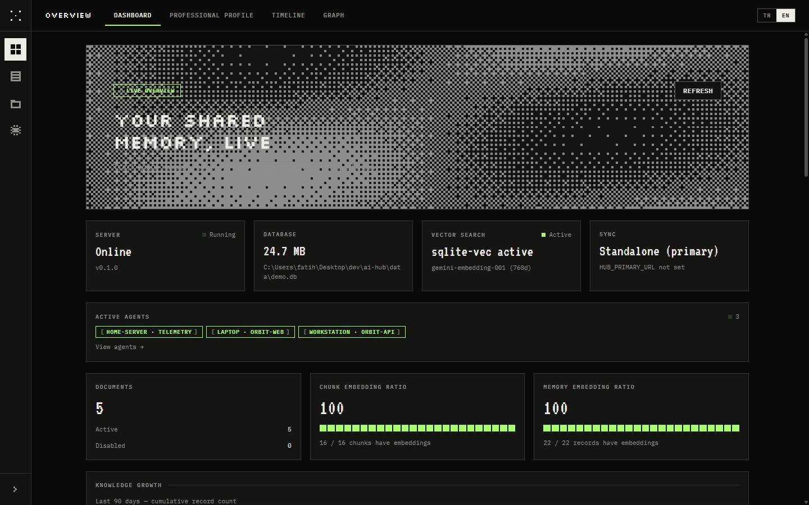
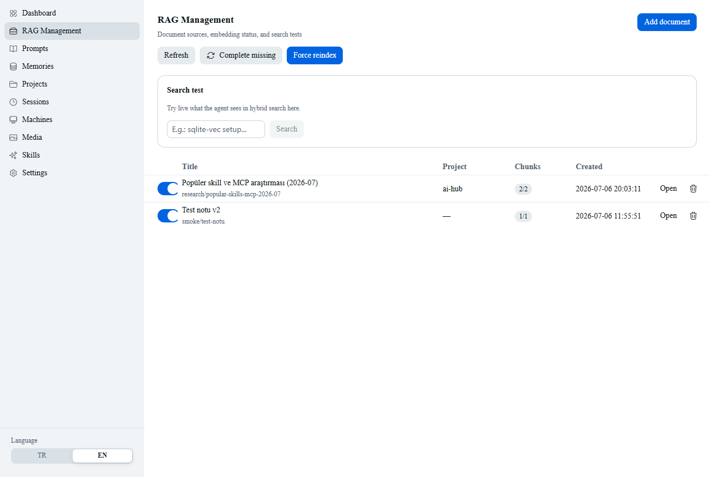
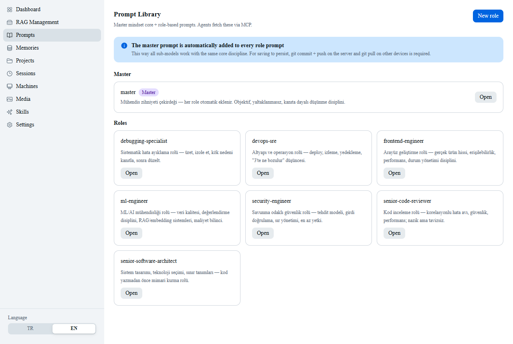
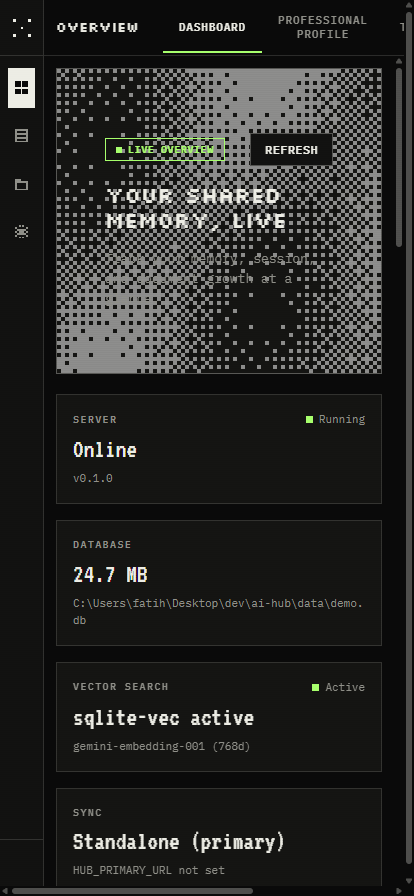

# ai-hub

**A shared memory, RAG, and project-context server for every AI agent you use.**

Claude Code, Cursor, opencode, Codex CLI, and custom agents each keep their own
context today — decisions made in one tool are invisible to the others, and
switching devices means starting from zero. ai-hub is a small self-hosted
server (MCP + REST) that gives all of them one common brain: structured
memory, hybrid document search (RAG), project maps, and role-based system
prompts. It runs on a Raspberry Pi 5 on your own network and follows you
across every machine and every agent.

## Why this exists

Multi-agent workflows have a context problem:

- A decision made while pairing with Claude Code isn't visible to Cursor an
  hour later.
- Switching from your desktop to your laptop (or your phone) means re-explaining
  what you were doing.
- Every agent re-derives project context from scratch instead of reading a
  shared, structured map.
- "I learned X yesterday" has no durable home — it either lives in scrollback
  or nowhere.

ai-hub is a deliberately small answer to that: one server, one SQLite file,
one protocol (MCP) that every agent already speaks, plus REST for anything
that doesn't. No vector database cluster, no message queue, no Docker layer —
just enough infrastructure to make memory persistent and searchable across
tools and devices.

## Features

- **Shared memory** — facts, preferences, decisions (with rationale), and
  how-tos, saved by any agent and retrievable by any other. Hybrid search
  (BM25 via FTS5 + vector via `sqlite-vec`, merged with Reciprocal Rank
  Fusion) finds the right memory whether the match is lexical or semantic.
- **RAG document store** — ingest notes, READMEs, research write-ups, or
  learning summaries; markdown-aware chunking, automatic embedding, hybrid
  retrieval with source references.
- **Project maps** — one YAML-backed record per project: summary, stack,
  decisions, current focus, next steps. Any agent, any device, calls
  `project_get("name")` and has full context instantly.
- **Role-based system prompts** — a library of prompts (senior software
  architect, code reviewer, debugging specialist, security engineer,
  frontend engineer, devops/SRE, ML engineer) with a shared "engineering
  mindset" core auto-injected into every role, including prompts handed to
  local models.
- **Local AI orchestration** — route simple/bulk text work to a local LLM
  (LM Studio or Ollama, zero API cost) and image/video/audio generation to
  ComfyUI, all driven from any connected agent via `local_llm` /
  `media_generate`. Local models can also reach the hub directly: `hub agents
  connect` wires LM Studio's MCP client to the hub (see
  `docs/local-models.md`).
- **Cross-device sync** — a local-first, last-write-wins sync model
  (millisecond timestamps, deterministic content-hash tie-break) so memories
  and project maps created on one machine reconcile cleanly with the primary
  instance and all replicas converge to the same winner.
- **MCP + REST, same core** — every capability is exposed both as an MCP tool
  (for agents that speak MCP over Streamable HTTP) and as a REST endpoint
  (for scripts, custom agents, and the web UI) — one implementation, two doors.
- **Web UI** — a small React dashboard for browsing memory, RAG documents,
  projects, and prompts from a browser, including your phone.

## Architecture

```
┌──────────────────────────────────────────────────────────────┐
│ Raspberry Pi 5 — "hub"  (Tailscale IP: 100.x.x.x)             │
│                                                                │
│  ┌────────────────────────────────────────────┐               │
│  │ hub-server (Node 22, systemd)                │              │
│  │  ├── MCP endpoint   /mcp   (Streamable HTTP)  │             │
│  │  ├── REST API       /api/* (scripts, agents)  │             │
│  │  └── Web UI         /      (dashboard, PWA)   │             │
│  └───────────────┬────────────────────────────┘               │
│                  │                                            │
│  ┌───────────────▼────────────────────────────┐               │
│  │ SQLite (single file: hub.db)                  │             │
│  │  ├── memories      (structured memory)        │             │
│  │  ├── documents     (RAG source docs)           │             │
│  │  ├── chunks + vec  (sqlite-vec embeddings)     │             │
│  │  ├── chunks_fts    (FTS5 BM25 index)           │             │
│  │  └── projects      (project maps)              │             │
│  └────────────────────────────────────────────┘               │
│                                                                │
│  Nightly backup: sqlite backup + markdown export → git push   │
└──────────────────────────────────────────────────────────────┘
         ▲ Tailscale (private network; Funnel optional for public access)
         │
   ┌─────┴──────────────────────────────────────┐
   │ Devices (desktop, laptop, phone)             │
   │  ├── Claude Code  → MCP (Streamable HTTP)    │
   │  ├── Cursor / Windsurf → MCP (mcp.json)      │
   │  ├── opencode     → MCP (opencode.json)      │
   │  ├── Codex CLI    → MCP (config.toml)        │
   │  ├── claude.ai / ChatGPT / Gemini → MCP (Funnel + ?token=) │
   │  └── custom scripts → REST API               │
   └────────────────────────────────────────────┘
```

Embedding calls (Gemini API) are made from the Pi only — clients send raw
text, so the API key lives in exactly one place.

For the full data model and phased build plan, see [`PLAN.md`](PLAN.md).

## Screenshots

| Dashboard | RAG search | Prompts | Mobile |
|---|---|---|---|
|  |  |  |  |

## Quick start

**You don't need a Raspberry Pi.** The hub runs on any machine with Node 22+ —
Windows, macOS, or Linux. The installer clones the repo, builds it, generates a
`.env` with a random token, sets up autostart (systemd / launchd / Startup
shortcut), and connects the AI agent apps it detects on your machine. A Pi (or
any always-on box) is only worth adding later if you want one instance that is
reachable from all your devices.

### Option A: one-click installer

```bash
# macOS / Linux
curl -fsSL https://raw.githubusercontent.com/fthsrbst/ai-hub/master/scripts/install.sh | bash
```

```powershell
# Windows
irm https://raw.githubusercontent.com/fthsrbst/ai-hub/master/scripts/install.ps1 | iex
```

The installer clones the repo, installs dependencies, builds, and writes a
starter `.env`.

### Option B: manual

```bash
git clone https://github.com/fthsrbst/ai-hub.git
cd ai-hub
npm ci
npm run build
cp .env.example .env   # edit HUB_TOKEN, GEMINI_API_KEY (optional)
npm run dev            # http://127.0.0.1:8033
```

Without `GEMINI_API_KEY` the server still runs — it falls back to FTS-only
(keyword) search instead of hybrid search. Nothing crashes; you lose semantic
recall until you add a key.

### Raspberry Pi deploy

```bash
curl -fsSL https://raw.githubusercontent.com/fthsrbst/ai-hub/master/deploy/setup-pi.sh | bash
```

This installs Node 22, clones the repo, builds server + web UI, generates a
`.env` with a random `HUB_TOKEN`, installs a systemd unit (`hub@<user>`), and
schedules a nightly backup cron job. See [`deploy/setup-pi.sh`](deploy/setup-pi.sh)
and [`deploy/clients.md`](deploy/clients.md) for details.

## Connecting an agent

Every agent talks to the same `/mcp` endpoint. Replace `<HUB>` with your
server URL (`http://127.0.0.1:8033` locally, `http://100.x.x.x:8033` on your
tailnet) and `<TOKEN>` with your `HUB_TOKEN`.

**Claude Code**
```bash
claude mcp add --transport http --scope user hub <HUB>/mcp \
  --header "Authorization: Bearer <TOKEN>"
```

**Cursor / Windsurf** (`~/.cursor/mcp.json`)
```json
{
  "mcpServers": {
    "hub": {
      "url": "<HUB>/mcp",
      "headers": { "Authorization": "Bearer <TOKEN>" }
    }
  }
}
```

**opencode** (`~/.config/opencode/opencode.json`)
```json
{
  "mcp": {
    "hub": {
      "type": "remote",
      "url": "<HUB>/mcp",
      "headers": { "Authorization": "Bearer <TOKEN>" }
    }
  }
}
```

**Codex CLI** (`~/.codex/config.toml`)
```toml
[mcp_servers.hub]
url = "<HUB>/mcp"
http_headers = { "Authorization" = "Bearer <TOKEN>" }
```

After connecting, run `hub sync` on each device — it copies the shared skill
set into `~/.claude/skills/` and updates the managed block in `CLAUDE.md` /
`AGENTS.md` / `.cursor/rules` so every agent knows the hub exists and when to
use it. Full client details: [`deploy/clients.md`](deploy/clients.md).

## Remote access (claude.ai, ChatGPT, Gemini, phone)

Anthropic's, OpenAI's, and Google's hosted apps connect from their own cloud
infrastructure, not from your tailnet — the endpoint has to be reachable over
the public internet. Tailscale **Funnel** does this without opening a port on
your router:

```bash
sudo tailscale funnel --bg 8033
```

Since these platforms can't attach custom headers, the server also accepts
the token as a query parameter:

```
https://<your-device>.<your-tailnet>.ts.net/mcp?token=<HUB_TOKEN>
```

For devices already on your tailnet (including your phone with the Tailscale
app installed), `tailscale serve` is enough — no public exposure needed, and
the same URL works as an installable PWA for the web dashboard. Full
walkthrough, security notes, and per-platform setup steps:
[`docs/connectors.md`](docs/connectors.md).

## Maturity / honesty table

No inflation — this is what's actually solid versus still rough.

| Area | Status | Notes |
|---|---|---|
| Memory CRUD + hybrid search | Stable | Used daily; FTS-only fallback tested |
| RAG ingest + search | Stable | Chunking is markdown-aware but simple; no re-ranking model |
| Project maps | Stable | YAML + DB sync works; no conflict UI beyond LWW |
| MCP server (tools) | Stable | All tools listed in `src/server/mcp.ts` are in daily use |
| REST API | Stable | Mirrors MCP tools; used by CLI and web UI |
| Cross-device sync (LWW) | Functional, lightly tested | Works for the author's two-to-three-device setup; not stress-tested for heavy concurrent writes |
| Web UI | Functional | Covers memory/RAG/projects/prompts browsing; not a polished product UI |
| Local LLM orchestration (LM Studio, Ollama) | Functional | Works when the backend is reachable; no retry/queueing beyond basic error handling |
| Media generation (ComfyUI) | Experimental | Works for the author's own workflows; expect to write your own `workflows/*.json` |
| Public connector exposure (Funnel + `?token=`) | Functional, use with care | Token-in-URL is a real trade-off — see [`docs/connectors.md`](docs/connectors.md) |
| Auth model | Basic | Single bearer token, no per-agent scoping or rotation automation |
| Backup/restore | Functional | Nightly cron + markdown export exist; restore path is manual |
| Qdrant / larger-scale vector store | Not built | `sqlite-vec` is fine to roughly 1M vectors; migration path is planned, not implemented |

This is a personal-scale tool built for one user running a handful of
devices — it is not hardened for multi-tenant or public deployment beyond the
token + Funnel model described above.

## License

MIT — see [`LICENSE`](LICENSE).
