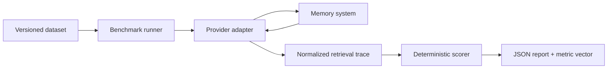
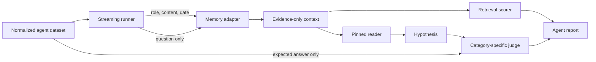
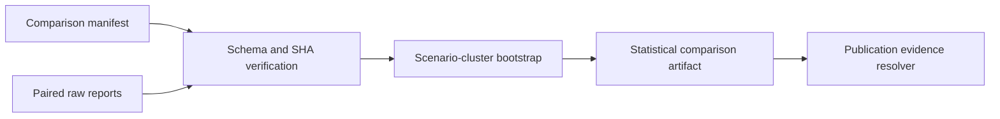
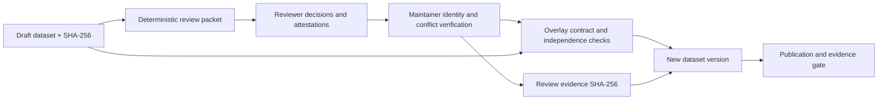

# Memory Bench architecture

## Decision

Memory Bench starts inside the Mnema repository under `benchmarks/memory/`, but
it is not part of Mnema's runtime or `eval:context` release gate.

The name is provisional. A distinct public name must be chosen before
extraction because “MemBench” is already used by an academic memory benchmark.

This gives the first version access to a real Mnema adapter and the existing CI
toolchain without coupling the benchmark schema to Mnema internals. Extract it
to a separate public repository after all of these are true:

1. the dataset and report schemas reach version 1;
2. Mnema plus at least two independent systems run through the same adapter
   contract;
3. the public corpus contains at least 100 human-reviewed queries;
4. dataset licenses, contribution rules, and a reproducible leaderboard policy
   have been reviewed.

`eval:context` remains Mnema's live-database regression suite. Memory Bench uses
versioned, portable datasets and disposable namespaces so another system can
run exactly the same workload.

Benchmark code inherits the repository MIT license. Original portable dataset
artifacts use CC BY 4.0 so commercial and academic users can share and adapt the
corpus while preserving attribution and change notices. Third-party inputs
retain their own terms and are not vendored by default.

## Tracks

Memory systems should not receive one opaque score. Memory Bench reports a
metric vector and separates two tracks:

- **Core memory** (implemented first): explicit writes, retrieval, updates,
  deletion, temporal recall, abstention, and namespace isolation. It needs no
  answer model or judge.
- **Agent memory** (streaming execution contract implemented):
  timestamped conversations or trajectories are ingested online; the system
  performs extraction and consolidation, then a pinned answer model and
  category-specific judge evaluate answers. The cleaned LongMemEval
  import-by-path and per-scenario runner contracts are implemented. The bundled
  deterministic components are harness-only. A pinned OpenAI Responses reader
  and LongMemEval judge port are candidate-class; live cross-validation,
  provider qualification, and the LongMemEval-V2 multimodal trajectory importer
  remain planned.

The separation matters because changing the answer model can improve an
end-to-end QA score even when the memory system is unchanged.

## Data flow

The runner owns ordering and timing. An adapter only translates the common
operations into provider calls and returns normalized hits. The scorer never
calls a provider.

The agent track has a stricter separation so a better answer model cannot be
mistaken for a better memory backend:

The adapter never receives expected answers, evidence-session IDs, or
per-message answer labels. Public traces retain source session IDs, scores,
hashes, and byte counts, but not raw retrieved conversations or expected
answers.

Comparison uncertainty is a post-run evidence layer:

The analysis recomputes quality metrics from traces, pairs identical
query/scenario observations, and resamples scenarios rather than treating
correlated queries as independent. Its deterministic seed and method parameters
are evidence, while its intervals remain descriptive and conditional on the
exact run.

## Review flow

Generated datasets are immutable inputs. Review decisions live in separate,
content-addressed overlays and produce a new materialized dataset version:

An overlay targets the exact dataset bytes, packet hash, and per-scenario
review-subject hash. It supports `approve`, `revise`, `reject`, and ignored
`pending` entries for batch review. Approval adds a structured review entry
with reviewer identity/type, timestamp, and overlay hash. Rejection removes the
case. Revision replaces the scenario body, attributes the new labels to the
reviser, and leaves the case draft so another human must approve it.

Application never overwrites an input and requires a new dataset version.
Finalization verifies all supplied overlay bytes, scenario hashes, reviewer
independence, a distinct human maintainer-verifier, identity/conflict
affirmations, timestamp ordering, affirmative reviewer attestations, corpus
coverage, license, and structural quality. Reviewer and maintainer
affiliations, conflicts, and disposition remain in the overlay. The system can
verify artifact integrity and declared role separation, but real-world human
identity remains an external fact attested by the maintainer.

## Data model

- **Dataset**: schema version, name, version, license, track, scenarios.
- **Agent dataset**: a content-addressed upstream source plus normalized
  questions, answers, ability labels, ordered sessions, messages, raw
  timestamps, abstention semantics, and evidence-session IDs.
- **Scenario**: an ordered operation sequence with language, difficulty,
  origin, author type, optional generation template, and independent-review
  metadata.
- **Review entry**: declared reviewer identity/type, timestamp, and immutable
  overlay evidence hash.
- **Review packet/overlay**: deterministic review material plus hash-bound
  `approve`, `revise`, or `reject` decisions, affiliation/conflict disclosure,
  independence/publication/privacy attestations, and distinct human maintainer
  identity/conflict verification kept outside generated corpora.
- **Memory record**: benchmark ID, namespace scope, content, observation time,
  and optional metadata.
- **Operation**: write, update, delete, or query.
- **Query expectation**: relevant IDs, forbidden IDs, content assertions,
  top-k, and ability category.
- **Adapter**: provider identity/config plus setup, write, update, delete,
  search, and teardown lifecycle.
- **Report**: pinned dataset and adapter metadata, per-query traces, latency
  distributions, recall/precision/MRR, forbidden-hit rate, abstention accuracy,
  query pass rate, language/ability/difficulty slices, and the dataset
  publication status.
- **Agent report**: independently identified adapter, reader, and judge
  components; retrieval and QA metrics; stage latency; per-scenario cleanup;
  runtime failures; and hash-only evidence descriptors.
- **Adapter telemetry**: provider requests/retries/polls, transferred bytes,
  provider processing time, explicit cost availability, and cleanup
  verification.
- **Normalized feedback**: every returned hit becomes `helpful` or `noisy`, and
  every expected but absent record becomes `missing`. This generalizes Mnema's
  `recall_feedback` signal without making Mnema's database schema part of the
  benchmark.
- **Core comparison manifest**: dataset/report hashes, Git state, sanitized
  adapter settings, runtime environment, one process-isolated run per adapter,
  and explicit separation between runtime failures and query-quality failures.
- **Agent comparison manifest**: the same audit envelope plus child PIDs,
  reader/judge/model identity, a canonical equal-configuration fingerprint,
  component result class, and fail-closed comparability/publication claims.
- **Statistical comparison artifact**: exact comparison/report hashes,
  deterministic paired scenario-cluster bootstrap parameters, trace-derived
  point differences and percentile intervals, sparse-metric blockers, and
  explicit no-ranking/no-significance policy.
- **Evaluator parity artifact**: hashes the candidate report and official
  evaluator JSONL, pins the upstream evaluator source, verifies decision-ID,
  hypothesis, model, and prompt compatibility, and reports label agreement
  without copying raw questions, answers, hypotheses, or evidence.
- **Component qualification overlay**: binds one complete adapter, reader, or
  judge configuration to immutable core/agent/parity evidence and records
  distinct submitter, reviewer, and maintainer-verifier attestations.
- **Agent publication manifest**: post-run evidence resolver that re-hashes the
  comparison, reports, paired statistical artifact, parity artifacts, and
  qualification overlays before a complete bundle can be promoted to
  benchmark-class.

Provider record IDs are never used as ground truth. Adapters preserve benchmark
IDs in metadata or a local mapping so update and deletion behavior can be
scored consistently.

## Public schema boundary

External artifacts are defined by generated JSON Schema Draft 2020-12
contracts under `benchmarks/memory/schemas/v1/`. The versioned schemas cover
core datasets, agent-memory datasets, core and agent reports, core and agent
comparison manifests, evaluator parity, component qualifications, agent
publication evidence, statistical comparison, review packets, and review
overlays.
Their `$id` values use stable
`urn:memory-bench:schema:*:1` identifiers so tooling need not depend on
repository paths.

The TypeScript definitions are the source, and CI rejects drift between those
definitions and committed JSON files. Strict Ajv validation exercises both
positive artifacts produced by the real runner/review flow and deliberately
invalid artifacts. JSON Schema owns portable shape, ranges, enums, formats,
closed objects, and local conditional constraints. Runtime parsers own
cross-record and stateful rules such as identifier uniqueness, legal operation
ordering, authorship independence, release coverage, and overlay evidence
chains.

Retrieval traces deliberately preserve duplicate returned IDs. Dataset
expectation lists must be unique, while a provider returning the same record
twice is observable benchmark evidence rather than a serialization error.

## Upstream import boundary

Third-party corpora are not release assets. The LongMemEval importer accepts a
local user-supplied file only when its size and SHA-256 match the pinned
upstream revision. It streams one top-level instance at a time, validates the
upstream shape and cross-field session references, writes a normalized
agent-memory dataset to a temporary file, and makes that file visible only
after the complete import succeeds. Existing outputs are never replaced.

The normalized artifact records the upstream repository revision, immutable
file URI, original filename, checksum, size, subset, and license. Raw timestamp
strings are preserved because LongMemEval does not declare a timezone; the
importer does not invent one.

The runner then performs two bounded-memory passes over the normalized
artifact. The metadata pass validates top-level fields and computes the
artifact SHA-256 without assembling `scenarios`; the execution pass parses and
yields one scenario at a time. Every scenario owns an isolated memory
lifecycle. Reader/judge failures remain reportable runtime failures and can
continue only after verified cleanup. Unverified cleanup terminates the
remaining scenario loop. Global teardown still runs.

The deterministic literal adapter, fixture reader, and fixture judge are
classified as harness components. They exercise the boundary but cannot
produce publishable LongMemEval numbers.

The model-backed reader and judge use the current OpenAI Responses shape:
credential-free base URL, bearer credential kept outside reports,
`temperature:0`, `store:false`, bounded output, nested `output_text` parsing,
and provider-reported token counts. The reader presents dated evidence in
chronological order and treats retrieved content as untrusted data. The judge
ports the five category paths and `yes` substring decision rule from
LongMemEval's evaluator at commit
`9e0b455f4ef0e2ab8f2e582289761153549043fc`.

These components are `candidate` because switching the upstream evaluator from
Chat Completions to Responses may affect outputs even with the same pinned
model and semantic prompt. Promotion to `benchmark` requires a live
cross-validation artifact against the official Python evaluator, with model,
prompt, API surface, request policy, and mismatches published. A
benchmark-class run also requires every memory, reader, and judge component to
be pinned, reviewable, and independently qualified.

The Mnema agent adapter is also candidate-class. It runs the real Mnema core
against one temporary FTS-only database and writes each dated source session as
bounded, ordered fragments. Every fragment maps back to the benchmark session
identity, keeping oversized LongMemEval sessions within Mnema's
20,000-character memory-body contract without losing evidence attribution.
Each scenario has a hashed tag. Cleanup deletes every mapped record and scans
the temporary database to verify that no record with the scenario tag remains.
Global teardown closes and removes the database and restores the caller's
environment. This validates Mnema's execution path without touching a
configured production database, but it is not an independent provider
qualification.

Mem0, Letta, and Zep agent adapters reuse their core REST clients under a
stricter per-scenario wrapper. The wrapper creates one disposable core run with
one scope, hashes provider-facing record IDs, maps results back to source
sessions locally, aggregates network telemetry, and accepts a new scenario
only after the core client's cleanup is verified. LongMemEval wall-clock dates
are encoded as UTC only for provider timestamp fields; the original strings
remain reader evidence. Zep's documented 10,000-character episode boundary is
handled with ordered JSON message fragments. A failed scenario cleanup remains
active so global teardown can retry the exact same namespace.
Zep's 400-character graph-query and 50-result limits are explicit adapter
constraints: out-of-range benchmark requests fail before network I/O rather
than being silently narrowed.

All three managed adapters are candidate-class. Their local HTTP contract
servers validate authentication, request shapes, transient search retry,
date/size boundaries, source-session mapping, CLI selection, cleanup, and
cleanup recovery. Contract success proves harness behavior only; a provider
version is not qualified until a real service run records the live API
revision, configuration, cost/latency telemetry, and verified cleanup.

The agent comparison orchestrator is a separate parent process. It opens the
normalized dataset once to establish immutable identity, then spawns one
sequential child process per adapter using the same reader, judge, model,
top-k, and scenario limit. Each child report must pass the committed schema and
match the parent dataset/configuration invariants. The manifest stores a
canonical evaluation fingerprint and marks itself comparable only when every
run completes with that one fingerprint. Harness or candidate components keep
publication eligibility false even when the run is mechanically comparable.

Evaluator cross-validation is a separate, hash-pinned boundary. The parity
parser consumes the official Python script's JSONL result shape and rejects
malformed rows, additional fields, blank rows, and duplicate question IDs. A
candidate decision is compared only when its scenario ID and complete
hypothesis string match the official row. Coverage gaps and hypothesis
mismatches make the artifact non-comparable; label differences remain measured
results. `--require-exact` turns comparable, zero-mismatch agreement into a
release/CI exit gate after the artifact is atomically written.

The artifact pins LongMemEval commit
`9e0b455f4ef0e2ab8f2e582289761153549043fc` and evaluator source SHA-256
`ecce9c4c79dc89d99534ac17b383a5cbb5b9f0c69ee98adaf0684742e3d95251`.
It records that upstream uses Chat Completions while Memory Bench uses
Responses. Exact agreement still cannot self-certify independent execution, so
publication eligibility remains false until separate live-run provenance and
reviewer evidence are attached.

Qualification and publication therefore use overlays rather than mutating
candidate reports. An adapter overlay requires both a core report and an agent
report; a reader overlay requires an agent report; a judge overlay requires an
agent report plus an exact, comparable evaluator-parity artifact. Complete
component configuration is canonicalized and hashed, source files are
SHA-bound, and local/fake network endpoints fail qualification. Submitter,
human reviewer, and human maintainer-verifier identities are distinct.

The post-run publication manifest resolves every candidate component hash used
by every report. It also resolves one exact parity artifact per report and one
paired statistical artifact for the comparison, then rechecks process
isolation, the shared evaluation fingerprint, clean source commit,
report/comparison invariants, complete confidence intervals, role attestations,
public release metadata, disclosures, and audit attestations. A draft remains
candidate/ineligible. Only successful finalization creates a new
benchmark-class publication claim; original reports remain immutable candidate
evidence.

## Comparison rules

1. Publish provider version, adapter version, retrieval mode, model names,
   thresholds, hardware/hosting profile, retry policy, and ingestion settling
   time.
2. Use a fresh disposable namespace for every run and clean it up even after a
   failure.
3. Do not tune configuration per query or provider after seeing test answers.
4. Report retrieval and end-to-end tracks separately.
5. Report cost, ingestion time, and query latency beside quality metrics.
6. Keep raw normalized traces so a published aggregate can be audited.
7. Publish paired scenario-cluster confidence intervals for quality deltas;
   disclose that they are unadjusted, descriptive, and do not measure
   repeated-run provider variance.
7. Mark failures and unavailable capabilities explicitly; never silently skip a
   case.
8. Call results preliminary until the dataset labels and adapter behavior have
   been independently reviewed.
9. Never put credentials or raw provider secrets in adapter config or reports.
10. Adapter teardown must be idempotent because the runner invokes it after
    partial setup and failed operations.
11. AI-authored cases stay draft until a different reviewer validates their
    ground truth; release checks enforce human-review evidence, review status,
    ability coverage, and a minimum corpus size.
12. Public datasets must name a resolved license, and adapted scenarios must
    retain a source URI so licensing and label provenance remain auditable.
13. A total query count is insufficient: release requires a minimum count per
    ability and rejects exact duplicate query/content labels within one scope.
    Cross-scope duplicates remain visible but may be legitimate isolation
    cases. Template concentration, language, difficulty, and authorship
    distributions remain visible in corpus analysis.
14. Generated datasets are never edited during review. Every applied overlay
    creates a new dataset version, and changing the overlay bytes later
    invalidates its stored SHA-256 evidence.

## First risk spike

The riskiest assumption is that systems with very different abstractions can
preserve enough identity and scope information for lifecycle scoring. The same
contract now runs through a deterministic literal adapter, a real temporary
FTS-only Mnema database, and local HTTP contract servers for the current Mem0,
Letta, and Zep API shapes:

- Mem0 uses `infer:false`, hashed per-scope users, one hashed run ID, async
  event polling, and verified run-scoped deletion.
- Letta uses one disposable agent, archival-memory passages, hashed scope tags,
  and agent deletion. Passage update is represented transparently as
  replacement creation followed by old-passage deletion.
- Zep uses one disposable standalone graph per scope and explicit text
  episodes with `scope:"episodes"` search. Episode update is likewise a
  replacement because only episode metadata can be patched.

The adapters share the same timeout, bounded safe-read/idempotent-cleanup retry,
byte telemetry, secret redaction, and recoverable teardown behavior. Live paid
service runs remain a separate qualification gate; contract-server scores are
harness evidence, not provider quality results.

## Related work

- [LongMemEval](https://github.com/xiaowu0162/LongMemEval) evaluates information
  extraction, multi-session reasoning, knowledge updates, temporal reasoning,
  and abstention over long chat histories.
- [LongMemEval-V2](https://github.com/xiaowu0162/LongMemEval-V2) evaluates
  compact evidence retrieved from long agent trajectories, including latency.
- [Mem0](https://github.com/mem0ai/mem0), [Letta passage
  search](https://docs.letta.com/api/typescript/resources/passages/methods/search),
  and [Zep graph search](https://help.getzep.com/v3/sdk-reference/graph/search)
  expose different memory
  abstractions; adapters must preserve those differences in reported config
  rather than pretending they are identical.
